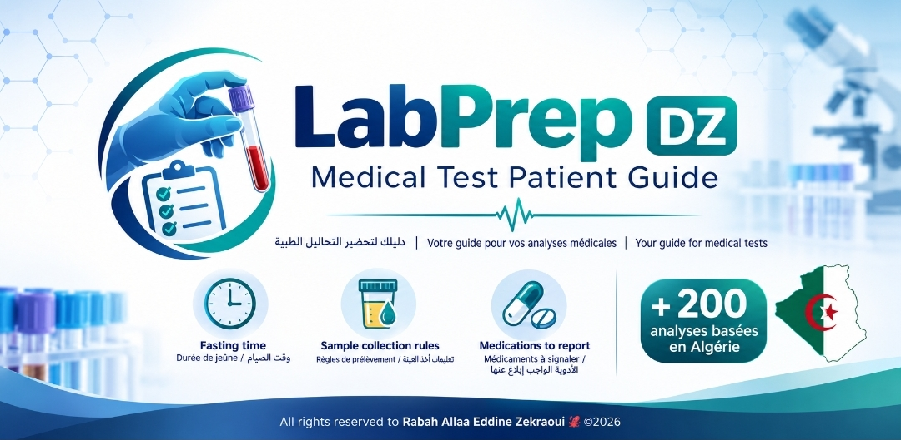

# LabPrep DZ 🧪

A free, non-profit guide to preparing for medical laboratory tests in Algeria - real fasting requirements, real sample collection rules, and real medication warnings for over 200 medical analyses. No generic copy-pasted advice, no invented protocols. Created voluntarily by Zekraoui Rabah Allaa Eddine as a charitable project, in memory of and dedication to his father.

## Sections

- **Test Database** - 201 medical analyses across biochemistry, hematology, coagulation, bacteriology, urology, hormonology, immunology, serology, and parasitology, each with exact fasting time, sample collection method, and medications to report
- **Similar Tests** - cross-referenced suggestions linking related analyses (e.g. Glycémie à jeun links to HbA1c, HGPO, Insulinémie)
- **Prescription Checklist** - select every test from one prescription, get one reconciled fasting time that covers all of them, with automatic conflict warnings for tests that are actually harmed by over-fasting
- **Nearby Labs** - locates medical laboratories, pharmacies, and hospitals near the user via OpenStreetMap, with an honest note on data coverage limits
- **Calm Mode** - gentler, reassuring explanations for the tests patients find most intimidating (blood draws, lumbar puncture, bone marrow aspiration)
- **Report a Missing Test** - lets any visitor anonymously flag a test that isn't in the database yet, sent directly through their own email or WhatsApp, no account required

## Features

- Fully trilingual: French, Arabic (with RTL support), English - all 201 tests translated in full, not just names
- No login, no backend, no tracking beyond the visitor's own device - pure static site
- Global search (Ctrl/Cmd+K), favorites with offline export, category filters, "Am I ready?" tappable prep checklist
- Fasting countdown timer, WhatsApp appointment reminders with auto-calculated fasting start time
- Dark mode, adjustable text size, installable as a PWA for offline use
- Every test tagged by category with its required tube color and fasting duration shown up front

## Tech

Plain HTML/CSS/JavaScript. No build step, no framework dependencies. Uses Font Awesome and Google Fonts via CDN, plus the OpenStreetMap Overpass API for the lab finder. Deploy anywhere that serves static files.

## License / Contact

Free to use, always. This project earns nothing and always will remain free. Questions or feedback: reach out on [LinkedIn](https://www.linkedin.com/in/zekraouirabahallaaeddine) or [Telegram](https://t.me/Itzjust_me), or see the Support section in the app for voluntary contributions.

